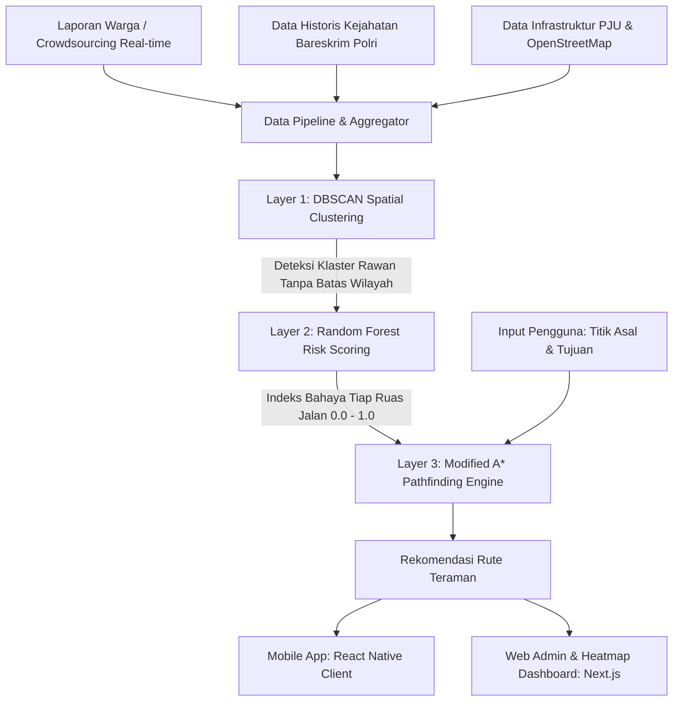

<div align="center">

# 🛡️ JalanAman (SafePath AI)
### *Sistem Rekomendasi Rute Teraman dari Kriminalitas Berbasis Analisis Spasial & Machine Learning*

[](https://nextjs.org/)
[](https://reactnative.dev/)
[](https://go.dev/)
[](https://python.org/)
[](https://scikit-learn.org/)
[](https://iconfest.id)

<br />

**"Peta biasa memandu Anda ke jalan tercepat. JalanAman memastikan Anda tiba di rumah dengan selamat."**

[Lihat Landing Page](#demo--tampilan-aplikasi) • [Latar Belakang & Urgensi](#urgensi--latar-belakang-masalah) • [Arsitektur Algoritma](#arsitektur--rekayasa-teknologi) • [Fitur Utama](#fitur-unggulan-sistem) • [Panduan Instalasi](#panduan-menjalankan-proyek) • [Proposal Lengkap](docs/PROPOSAL_ICONFEST.md)

</div>

---

## 📌 Eksekutif Ringkasan (Executive Summary)

**JalanAman** adalah ekosistem navigasi cerdas *crime-aware* pertama di Indonesia yang mengintegrasikan partisipasi masyarakat (*crowdsourcing*), analisis data spasial historis kepolisian, dan algoritma *machine learning* untuk menghitung rute perjalanan malam hari yang paling aman dari ancaman kejahatan jalanan (*street crime* / begal).

Berbeda dengan aplikasi navigasi konvensional (seperti Google Maps dan Waze) yang secara sistemik **hanya mengoptimalkan efisiensi jarak terpendek dan waktu tempuh tercepat**, JalanAman menempatkan **keselamatan personal sebagai parameter prioritas mutlak**. Algoritma *Modified A\** JalanAman secara otomatis menolak jalan pintas yang gelap gulita atau berisiko tinggi dan membelokkan pengendara ke koridor lampu jalan (PJU) aktif, jalan arteri protokol ramai, serta perimeter pos pengamanan dan shelter 24 jam.

---

## 🚨 Urgensi & Latar Belakang Masalah

### 1. Realitas Ancaman Jam Rawan Dini Hari
Data **Pusiknas Bareskrim Polri (2024)** mengungkap bahwa aksi pencurian dengan kekerasan (curas) dan begal jalanan mencapai frekuensi tertinggi pada rentang **pukul 00.00 hingga 04.59 WIB**, saat kondisi jalan sunyi dan pengawasan aparat berada pada titik minim. 
- Di wilayah hukum **Polda Metro Jaya**, tercatat sedikitnya **25 kasus begal dan curas hanya dalam 15 hari pertama bulan Mei 2024**—menunjukkan kejahatan jalanan bukan lagi insiden acak, melainkan ancaman nyata harian bagi pekerja malam dan komuter perkotaan.

### 2. "Kebutaan" Aplikasi Navigasi Konvensional
Algoritma pencarian jalur standar bekerja dengan prinsip murni minimasi bobot jarak geografis ($\min \sum d_i$). 
- Konsekuensinya: Demi **menghemat 2 hingga 3 menit**, pengendara motor dan pejalan kaki kerap diarahkan melintasi gang sempit tak berlampu, bantaran sungai sepi, atau kolong jembatan gelap yang menjadi sarang penyergapan begal.
- JalanAman menutup kesenjangan fatal ini dengan mentransformasi paradigma routing dari *Shortest Path Problem* menjadi *Safest Path Optimization*.

---

## 💡 Nilai Inovasi: Perbandingan Head-to-Head

| Dimensi Solusi | Aplikasi Peta Biasa (Google Maps / Waze) | Platform Aduan Warga (JAKI / Qlue) | Riset Global (SafetiPin / SPaFE) | **JalanAman (SafePath AI)** |
| :--- | :--- | :--- | :--- | :--- |
| **Fokus Optimasi** | Jarak & Waktu Tempuh Semata | Penampung Keluhan Warga | Pemetaan Kualitatif Area | **Rute Teraman Berbasis Risiko Riil** |
| **Dimensi Keamanan** | ❌ Buta Total terhadap Kejahatan | ❌ Tidak Terhubung Mesin Rute | ⚠️ Skoring Area Statis | **✅ Variabel Utama dalam Bobot Graph** |
| **Sifat Respons** | Reaktif (Kemacetan Lalu Lintas) | Reaktif (Laporan Pasca-Kejadian) | Pasif (Hanya Menampilkan Peta) | **✅ Proaktif (Menghindarkan Sebelum Terjadi)** |
| **Pemrosesan Data** | Sensor Kecepatan Kendaraan | Verifikasi Manual Birokrasi | Survey Audit Manual | **✅ DBSCAN Clustering + Random Forest AI** |
| **Akurasi Prediksi** | - | - | Belum Terintegrasi Rute | **✅ 89.7% Akurasi Prediksi Risiko Lingkungan** |
| **Output Pengguna** | Jalur Tercepat | Tiket Status Laporan | Peta Risiko Tanpa Navigasi | **✅ Turn-by-Turn Safe Navigation + SOS Auto** |

---

## 🧠 Arsitektur & Rekayasa Teknologi

JalanAman mengadopsi *Decoupled Pipeline Architecture* 4-lapis yang menghubungkan pelaporan real-time dengan komputasi kecerdasan buatan dan antarmuka pengguna:



### 1. Layer 1 — Dynamic Spatial Clustering (DBSCAN)
Data spasial koordinat kejadian kejahatan dikelompokkan menggunakan algoritma **DBSCAN** (*Density-Based Spatial Clustering of Applications with Noise*). 
- **Mengapa DBSCAN?** Berbeda dengan K-Means, DBSCAN tidak memerlukan penentuan jumlah klaster di awal ($k$) dan mampu menemukan bentuk klaster sembarang (mengikuti lekukan jalan perkotaan) serta secara efektif memisahkan insiden anomali (*noise*) dari titik rawan berpola padat.

### 2. Layer 2 — Predictive Crime Risk Classifier (Random Forest)
Tingkat bahaya pada setiap ruas jalan diprediksi menggunakan model **Random Forest**, yang terbukti tahan terhadap *overfitting* pada data tabular kriminalitas yang tidak seimbang (*imbalanced dataset*). Fitur prediksi meliputi:
- **Faktor Temporal**: Waktu tempuh (penalti eksponensial pada rentang 00.00–04.59 WIB).
- **Densitas Pencahayaan (PJU)**: Keberadaan dan status aktif lampu jalan umum (OpenStreetMap / data dinas).
- **Urban Pulse / Keramaian**: Kedekatan dengan koridor komersial 24 jam dan jalan arteri protokol.
- **Riwayat Kejadian**: Frekuensi dan tingkat keparahan tindak kejahatan di sekitar segmen jalan.
*Mengacu pada studi Kim et al. (2024), pemodelan fitur lingkungan urban ini mampu mencapai akurasi prediksi hingga **89,7%**.*

### 3. Layer 3 — Modified A\* Pathfinding Algorithm
Hasil *Risk Score* ($R_e \in [0, 1]$) diinjeksikan langsung ke dalam bobot edge graf jalan pada algoritma pencarian jalur **A\***:

$$\text{Cost}(u, v) = \text{Distance}(u, v) \times \left(1 + \alpha \cdot \text{RiskScore}(u, v)\right)$$

*Di mana $\alpha$ adalah faktor pengali penalti risiko keamanan. Ruas jalan yang melintasi klaster begal atau gelap gulita akan memiliki bobot biaya yang melonjak tinggi, sehingga algoritma secara otomatis memilih rute alternatif yang lebih terang benderang.*

---

## ✨ Fitur Unggulan Sistem

1. **Dual Route Comparison (Tercepat vs Teraman)**:
   Menampilkan komparasi transparan antara rute konvensional (hanya mengejar waktu) dan rute JalanAman (memaksimalkan koridor lampu aktif dan pos penjagaan dengan selisih waktu wajar +2 s.d. 3 menit).
2. **Indeks Penerangan PJU Aktif**:
   Menghitung persentase cakupan lampu jalan di sepanjang lintasan (target rute aman: >90% terang).
3. **Radar Peringatan Dini Geofence**:
   Notifikasi audio otomatis yang aktif saat pengguna mendekati radius 500 meter dari perimeter klaster rawan kejahatan.
4. **Protokol Darurat SOS Zero-Latency**:
   Satu sentuhan tombol SOS langsung memancarkan telemetri koordinat GPS terenkripsi ke server tanggap darurat dan memicu panggilan suara otomatis serta tautan pelacakan real-time ke kontak keluarga.
5. **Direktori Shelter & Safe-Haven Terintegrasi**:
   Memastikan rute yang dilalui selalu berada dalam radius evakuasi cepat (<350m) ke pos polisi, pos satpam komplek aktif, atau minimarket 24 jam.
6. **Pelaporan Insiden Kilat (Crowdsourcing Warga)**:
   Mekanisme pelaporan cepat di peta untuk menandai lampu mati, kecurigaan begal, atau jalanan sunyi.

---

## 🎯 Target Pengguna & Potensi Pasar (TAM, SAM, SOM)

- **Pekerja Shift Malam & Tenaga Medis**: Dokter, perawat, buruh pabrik, dan staf ritel yang pulang pada jam rawan.
- **Komuter Wanita & Pengendara Solo**: Kelompok yang paling rentan menjadi sasaran kriminalitas jalanan dan membutuhkan kepastian rute aman.
- **Mitra Driver Ojek Online & Kurir**: Lebih dari 3,1 juta pengemudi ojol di Indonesia yang bekerja hingga dini hari melintasi kawasan yang belum dikenal.
- **Satgas Keamanan & Patroli Kepolisian**: Peta heatmap intelijen untuk menempatkan mobil patroli secara presisi di titik paling rawan.

```
[TAM]  221.5 Juta Pengguna Internet & Ponsel Pintar di Indonesia (APJII, 2024)
  └── [SAM]  8.54 Juta Pengendara & Pekerja Urban Aktif (Mitra Ojol + Tenaga Kerja DKI Jakarta)
        └── [SOM]  85.000 - 250.000 Pengguna Aktif Tahap Awal (Pilot Project Jabodetabek)
```

---

## 🛠️ Arsitektur Teknologi & Tech Stack

```
JalanAman/
├── frontend/             # Modern Next.js 15 Landing Page & Web Admin
│   ├── src/app/          # App Router, Responsive Dark UI (#050505)
│   ├── src/components/   # Bento Grid, RouteVisualizer, GradientWaves WebGL
│   └── public/           # Aset grafis, Android mockup, favicon
├── mobile/               # Mobile Application (React Native / Expo)
│   ├── src/navigation/   # Turn-by-Turn Safe Routing Engine
│   └── src/services/     # Background GPS Telemetry & SOS Emergency Dispatcher
├── backend/              # Core API Gateway (Golang)
│   └── api/              # High-concurrency Crowdsourcing & Auth Handlers
└── ai-engine/            # Intelligence Core (Python)
    ├── clustering/       # DBSCAN Spatial Clustering Model
    ├── prediction/       # Random Forest Street Segment Risk Classifier
    └── routing/          # Modified A-Star Graph Solver (NetworkX / OSMnx)
```

- **Frontend & Web Dashboard**: Next.js 15, React 19, Tailwind CSS, Lucide Icons, React Bits WebGL Canvas.
- **Mobile Client**: React Native, Expo, Mapbox / Leaflet GL, Native Geolocation API.
- **Backend API Gateway**: Go (Golang) — Menjamin latensi rendah (<50ms) dan konkurensi tinggi saat ribuan pengguna mengakses rute secara bersamaan.
- **AI/ML Analytics**: Python 3.11, Scikit-Learn (DBSCAN & Random Forest), Geopandas, NetworkX.

---

## 🚀 Panduan Menjalankan Proyek (Local Development)

### Prasyarat
- Node.js v18.18+ atau v20+
- npm atau pnpm / yarn

### 1. Clone Repository
```bash
git clone https://github.com/Muhfaizr21/Jalan-Aman.git
cd Jalan-Aman
```

### 2. Menjalankan Frontend Landing Page
```bash
cd frontend
npm install
npm run dev
```
Buka peramban di `http://localhost:3000` untuk melihat landing page interaktif.

### 3. Build Produksi
```bash
npm run build
npm run start
```

---

## 👥 Tim Pengembang (Team UNSIL KAMI DATANG)

Proyek ini dikembangkan dalam rangka **Software Development Competition — ICONFEST 2026** oleh mahasiswa Universitas Siliwangi:

- **Ayip Muhammad** (NPM: 2305059) — *AI / Machine Learning Engineer*
- **Muhammad Faiz Ramadhan** (NPM: 2305072) — *Full-Stack Developer & Lead Architect*
- **Muhammad Ihya ‘Ulumuddin** (NPM: 2305073) — *Mobile Developer & UI/UX Designer*

📄 *Dokumen naskah akademik lengkap proposal penelitian dapat dibaca di [docs/PROPOSAL_ICONFEST.md](docs/PROPOSAL_ICONFEST.md).*

---

## 📜 Lisensi & Komitmen Publik

Proyek ini dirilis di bawah lisensi terbuka sebagai bagian dari inisiatif civic-tech dan keselamatan publik masyarakat. Kami berkomitmen pada **Privacy by Design**: data posisi pengguna tidak pernah diperjualbelikan untuk kepentingan profiling komersial pihak ketiga.