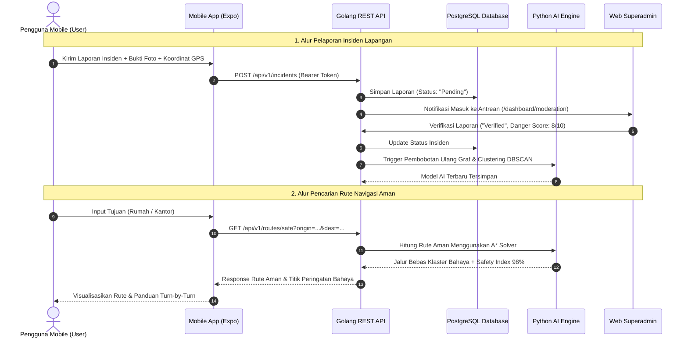

# 📱 JalanAman Mobile — Cetak Biru Lengkap Fitur Pengguna (User)

Dokumen ini adalah **spesifikasi arsitektur fungsional dan teknis komplit** untuk aplikasi mobile **JalanAman**. Aplikasi ini dirancang khusus untuk peran **`User` (Masyarakat, Pengendara Sepeda Motor, Pengemudi Ojek Online, dan Pejalan Kaki)** sebagai asisten keselamatan mobilitas malam hari berbasis kecerdasan buatan (AI).

---

## 🧭 Ikhtisar Peran (Role: `User`)
* **Platform:** React Native (Expo Router v4 / React Native 0.76+) untuk Android & iOS.
* **Basis Pengguna:** Seluruh warga sipil yang beraktivitas di jalan raya, terutama saat jam rawan (20:00 – 05:00 WIB).
* **Interaksi dengan Sistem:**
  - Mengonsumsi data rute aman yang dihitung oleh algoritma AI (A* Solver) dari backend Golang.
  - Berkontribusi aktif mengirimkan laporan bahaya lapangan (*crowdsourced reports*).
  - Terhubung langsung dengan operator **Superadmin** untuk verifikasi dan pemantauan darurat real-time.

---

## 🏛️ Peta Arsitektur 7 Modul Utama Pengguna Mobile

```
                         📱 JALANAMAN USER MOBILE ECOSYSTEM
                                         │
 ┌──────────────┬──────────────┬─────────┴────┬──────────────┬──────────────┬──────────────┐
 ▼              ▼              ▼              ▼              ▼              ▼              ▼
[1. BERANDA /  [2. AKUN &     [3. NAVIGASI   [4. TEMANI     [5. LAPORAN &  [6. DARURAT    [7. PRIVASI &
 DASHBOARD]     PROFIL]        CERDAS AI]     PERJALANAN]    REPUTASI]      SOS & HAVEN]   PENGATURAN]
  ├─ Status      ├─ Profil &    ├─ Safe vs     ├─ Live Trip   ├─ Lapor 4     ├─ Sirine &    ├─ Cache Peta
     Radar          Medis ID       Fast           Sharing        Kategori       Strobo         Offline
  ├─ Quick       ├─ Trust       ├─ Turn-by-    ├─ Safety      ├─ Tracking    ├─ Auto Call   ├─ Mode Hemat
     Search         Score          Turn           Timer          Status         110/112        Baterai
  ├─ Peta Live   ├─ Guardians   ├─ Hazard      ├─ Abnormal    ├─ Poin &      ├─ Rute Lari   ├─ Hapus
     Spasial        Circle         Alert          Stop/Crash     Lencana        Evakuasi       Jejak GPS
  └─ Safety      └─ Alamat      └─ Night HUD   └─ Fake Call   └─ Rating AI   └─ Radar       └─ UU PDP
     Feed           Favorit        Vision         Shield         Pasca-Rute     Shelter        Compliance
```

---

## 🏠 1. Modul Dashboard Awal (Home Screen / Main Command Center)
*Layar pertama yang dilihat pengguna saat membuka aplikasi.* Dirancang dengan gaya *Tactical Dark Vision (OLED Pure Black)* agar ramah terhadap mata pengendara di malam hari dan menyajikan status keamanan sekitar secara seketika (*glanceable*).

### A. Komponen Visual & Fungsional Dashboard Awal:
1. **Header Dinamis & Status Radar Lingkungan:**
   - **Sapaan Personal & Avatar:** Menyapa pengguna (*"Selamat Malam, Faiq 👋"*) beserta lencana level akun (*"Penjaga Lingkungan • Trust Score: 85"*).
   - **Pill Radar Status Wilayah (Live Environmental Safety Indicator):**
     - 🟢 **Kondisi Aman:** *"Radius 2 km Nihil Laporan Kriminalitas Aktif"* (indikator hijau berdenyut).
     - 🟡 **Kondisi Waspada:** *"Terdeteksi 2 Titik Rawan di Radius 1.5 km"* (peringatan kuning).
     - 🔴 **Kondisi Kritis:** *"Peringatan: 1 Kasus Pembegalan Baru Saja Dilaporkan dalam 800m"* (peringatan merah menyala).
   - **Widget Cuaca & Visibilitas Malam:** Informasi cuaca lokal (suhu, potensi hujan, kelembapan) yang mempengaruhi kelayakan dan risiko rute berkendara.
2. **Bilah Pencarian Cepat "Mau ke Mana Malam Ini?":**
   - Input alamat tujuan dengan auto-complete geocoding instan.
   - **Shortcut Satu-Sentuh (Quick Commute Chips):**
     - 🏠 **"Pulang ke Rumah"** — Seketika menghitung rute aman menuju alamat rumah yang tersimpan.
     - 🏢 **"Ke Kantor / Kampus"** — Navigasi cepat rute kerja/belajar.
     - 📍 **"Tujuan Terakhir"** — Riwayat pencarian rute sebelumnya.
3. **Peta Interaktif Spasial Langsung (Live Ambient Safety Map):**
   - **Visualisasi Posisi Pengguna:** Pin biru dengan kompas arah hadap kendaraan secara akurat.
   - **Hamparan Layer Spasial (Spatial Overlays):**
     - Lingkaran Klaster Merah: Area rawan kriminalitas hasil analisis DBSCAN AI.
     - Pin Kuning: Titik lampu penerangan jalan umum (PJU) yang padam.
     - Pin Biru / Tameng: Pos polisi, pos sabhara, atau SPBU 24 jam terdekat.
   - **Tombol Pengalih Layer Cepat (Layer Switcher):** Pengguna dapat mematikan/menghidupkan layer (hanya pos polisi, hanya titik terang, atau semua ancaman).
4. **Kartu Pintasan Aksi Taktis (Quick Action Cards):**
   - 🛡️ **"Mulai Rute Terproteksi"** — Buka perencanaan komparasi rute aman.
   - 📢 **"Lapor Bahaya Sekitar"** — Buka kamera dan formulir pelaporan cepat satu klik.
   - 🏛️ **"Shelter Terdekat"** — Menampilkan ringkasan: *"Polsek Terdekat: 450m (2 menit)"*.
   - 🚨 **Floating SOS Panic Beacon** — Tombol merah darurat mengambang di pojok layar yang siap dipencet kapan saja dalam keadaan panik.
5. **Feed Laporan Komunitas Sekitar (Nearby Safety Feed):**
   - Karosel horizontal berisi laporan masyarakat terverifikasi terbaru di radius pengguna:
     - *"10 mnt lalu • Begal gagal digagalkan warga di Flyover Pasar Rebo."*
     - *"25 mnt lalu • Lampu jalan padam 200m di Jl. Tubagus Angke."*
     - *"1 jam lalu • Pos Sabhara aktif patroli di Bundaran Senayan."*
6. **Kotak Nasihat Keselamatan AI (Daily Smart Safety Advisory):**
   - Kartu tips prediktif dari model AI: *"Jam menunjukkan pukul 23:45. Disarankan menghindari jalur bantaran kali dan tetap berada di jalur arteri ber-CCTV."*

---

## 👤 2. Modul Identitas, Profil & Keamanan Pengguna
Modul tata kelola data personal pengguna, rekam jejak kontribusi, data medis darurat, dan jejaring kontak pelindung.

### A. Autentikasi & Verifikasi Akun:
- **Metode Masuk:** Login/Registrasi via Email & Password atau Nomor WhatsApp dengan OTP instan.
- **Mode Tamu (Guest Mode):** Pengguna baru dapat langsung mengecek peta dan rute aman tanpa login. Login diwajibkan saat mengirim laporan atau memicu panggilan darurat.

### B. Pusat Profil & Pengaturan Personal:
- Foto Avatar, Nama Lengkap, Nomor Telepon WhatsApp Terverifikasi, dan Email.
- **Preferensi Moda Transportasi Default:** Pilihan antara *Sepeda Motor*, *Mobil*, atau *Pejalan Kaki*.
- **Manajemen Alamat Tersimpan:** Simpan alamat *Rumah*, *Kantor*, *Kosan*, atau *Rumah Keluarga*.

### C. Kartu Identitas Medis Darurat (Emergency Medical ID):
- **Data Medis Vital:** Golongan darah (A/B/AB/O, Rhesus), alergi obat, riwayat penyakit kronis (asma, epilepsi, jantung).
- **Akses Darurat:** Tombol pintas yang dapat diakses oleh petugas penolong/medis dari layar darurat SOS tanpa perlu membuka kode sandi ponsel.

### D. Sistem Reputasi & Tingkat Kepercayaan (Trust Score System):
- Skor reputasi dinamis berjenjang (0–100):
  1. 🥉 **Warga Baru (Skor 0–30):** Laporan memerlukan verifikasi ketat dari Superadmin.
  2. 🥈 **Warga Terpercaya (Skor 31–70):** Laporan mendapat prioritas peninjauan otomatis.
  3. 🥇 **Penjaga Lingkungan / Guardian (Skor 71–100):** Laporan memiliki bobot tinggi dan langsung memengaruhi pembaruan graf rute AI.
- **Lencana Kontribusi Warga:** Lencana gamifikasi (*"Mata Elang Malam"*, *"Pelopor Jalan Terang"*, *"100 KM Perjalanan Aman"*).

### E. Lingkaran Pelindung (Guardians Circle):
- Daftarkan 1–3 nomor WhatsApp/telepon keluarga atau kerabat terdekat.
- Menerima pesan darurat otomatis, tautan live tracking, dan koordinat GPS saat tombol SOS ditekan.

---

## 🧭 3. Modul Navigasi Cerdas & Algoritma Rute Aman
*File implementasi:* [`mobile/src/app/navigation.tsx`](file:///Users/muhfaiizr/Documents/Web%20Project/JalanAman/mobile/src/app/navigation.tsx)

### A. Komparasi Rute Ganda (Safe Route vs Fast Route):
- **Rute JalanAman (Prioritas Keselamatan):** Menggunakan algoritma modifikasi A* dengan fungsi penalti (*cost penalty function*) terhadap area minim lampu, gang sempit terisolasi, dan riwayat kriminalitas.
- **Rute Tercepat (Peta Standar):** Menampilkan perbandingan waktu tempuh dan rute umum beserta daftar titik bahaya yang dilewati jika memilih rute tersebut.
- **Safety Index Score:** Nilai persentase keselamatan rute (misal: *Rute Aman: 98% vs Rute Cepat: 61%*).
- **Rincian Taktis Jalur:** Jumlah lampu jalan aktif di sepanjang jalur, jumlah pos pengamanan yang dilewati, dan kondisi keramaian jalan.

### B. Navigasi Aktif Turn-by-Turn:
- Panduan belokan arah real-time dengan ikon vektor jelas dan jarak meter.
- **Mode Tampilan HUD Malam (Night HUD Vision):** Kontras tinggi berlatar belakang hitam pekat untuk meminimalkan kelelahan mata dan silau saat malam hari.
- **Indikator Batas Kecepatan & Speedometer Digital.**

### C. Peringatan Dini Bahaya Spasial (Hazard Alert):
- Notifikasi suara dan audio peringatan saat kendaraan berada dalam radius 250 meter dari zona rawan:
  - *"⚠️ Waspada: 250 meter di depan terdeteksi area rawan pembegalan & lampu padam."*

### D. Dynamic Re-routing Otomatis:
- Jika di rute yang sedang dilalui tiba-tiba muncul laporan darurat terverifikasi oleh Superadmin, navigasi otomatis mengarahkan kendaraan ke jalur alternatif yang lebih aman tanpa perlu berhenti.

---

## 🛡️ 4. Modul Proteksi Perjalanan Aktif (*Live Companion*)
Fitur pendamping cerdas yang menjaga pengguna tetap terhubung dengan orang-orang terdekat selama perjalanan sepi.

### A. Bagikan Perjalanan Langsung (Live Trip Sharing):
- Menghasilkan tautan pelacakan terenkripsi (`https://jalanaman.id/track/[token]`) yang dapat dikirim ke WhatsApp keluarga.
- Kerabat dapat memantau pergerakan live GPS, estimasi waktu tiba, dan sisa daya baterai ponsel pengguna langsung melalui browser tanpa wajib mengunduh aplikasi.

### B. Safety Timer (Check-in Otomatis / Deadman's Switch):
- Pengguna menetapkan batas waktu perkiraan sampai di tujuan (misal: 30 menit).
- Saat tiba, pengguna menekan tombol *"Saya Sudah Tiba"*.
- Jika waktu habis dan pengguna belum melakukan check-in, sistem memberi tenggat toleransi 3 menit sebelum mengirimkan notifikasi waspada dan lokasi GPS terakhir ke *Guardians Circle*.

### C. Deteksi Berhenti Abnormal (Abnormal Idle & Crash Detection):
- Menggunakan sensor akselerometer dan GPS: jika kendaraan tiba-tiba berhenti lama di tengah jalan sepi tak bertuan atau terdeteksi benturan keras kecelakaan, aplikasi memunculkan konfirmasi darurat: *"Apakah Anda baik-baik saja?"* dengan hitung mundur 30 detik.
- Jika tidak dibatalkan, alarm darurat otomatis diaktifkan.

### D. Panggilan Palsu Penyelamat (Fake Call Shield):
- Tombol kamuflase yang memicu ponsel berdering kencang dengan tampilan panggilan masuk palsu (misal dari "Ayah" atau "Polsek Terdekat").
- Memutar suara rekaman pria tegas seolah-olah sedang menunggu kedatangan pengguna, sangat efektif menggertak orang mencurigakan yang membuntuti pejalan kaki.

---

## 📢 5. Modul Pelaporan Komunitas & Evaluasi AI
*File implementasi:* [`mobile/src/app/report.tsx`](file:///Users/muhfaiizr/Documents/Web%20Project/JalanAman/mobile/src/app/report.tsx)

### A. Formulir Laporan Multi-Kategori Lapangan:
- 🔴 **Begal / Tindak Kekerasan:** Pembegalan, pemalakan, penodongan senjata tajam.
- 🟡 **Lampu PJU Padam:** Jalan gelap tanpa penerangan yang memicu kerawanan.
- ⚪ **Jalan Rusak / Berlubang:** Hambatan fisik jalan yang membahayakan nyawa pengendara.
- 🔵 **Area Sepi & Rawan:** Kerumunan geng motor liar atau lokasi pemalakan liar.

### B. Bukti Lapangan Terotentikasi:
- **Geotagging GPS Otomatis:** Mengunci koordinat latitude dan longitude secara otomatis saat form dibuka.
- **Unggah Bukti Visual:** Ambil foto kamera langsung di tempat atau pilih dari galeri.
- **Tingkat Keparahan (Severity Slider):** Pilihan skala tingkat bahaya 1 sampai 10.
- **Mode Anonim (Anonymous Whistleblower):** Opsi merahasiakan nama pelapor dari tampilan publik demi keselamatan pribadi pelapor.

### C. Pelacak Siklus Laporan (Incident Lifecycle Tracker):
- Halaman riwayat untuk memantau status laporan secara transparan:
  - 🟡 **Diajukan (Pending):** Menunggu tinjauan operator Superadmin.
  - 🟢 **Terverifikasi (Verified):** Laporan valid, langsung diplot pada peta publik dan model AI.
  - 🔵 **Selesai Ditangani (Resolved):** Masalah diselesaikan (PJU diperbaiki Dishub / polisi melakukan razia).

### D. Evaluasi Rute Pasca-Perjalanan (Post-Trip Feedback Loop):
- Dialog singkat 5-bintang saat navigasi selesai: *"Bagaimana kondisi rute tadi? Apakah penerangan jalan memadai?"*.
- Umpan balik warga ini menjadi *reward signal* untuk algoritma AI dalam mengkalibrasi ulang bobot rute berikutnya.

---

## 🚨 6. Modul Protokol Tanggap Darurat & Safe Haven
*File implementasi:* [`mobile/src/app/sos.tsx`](file:///Users/muhfaiizr/Documents/Web%20Project/JalanAman/mobile/src/app/sos.tsx) dan [`mobile/src/app/shelters.tsx`](file:///Users/muhfaiizr/Documents/Web%20Project/JalanAman/mobile/src/app/shelters.tsx)

### A. Tombol Panik SOS 1-Klik:
- Tombol darurat merah besar dengan animasi denyut sinyal darurat (*pulse beacon*).
- **Sirine Suara Kencang & Strobo Layar:** Menyalakan suara alarm maksimal dan lampu layar berkedip cepat untuk menarik perhatian massa sekitar.
- **Opsi Stealth SOS (Alarm Hening):** Mengirim sinyal darurat dan live koordinat ke server dan kepolisian secara diam-diam tanpa menimbulkan suara (untuk situasi todongan senjata).

### B. Panggilan Cepat Call Center Terpadu (Fast Dispatch):
- 👮 **Polisi 110:** Panggilan langsung ke Command Center Kepolisian.
- 🚑 **Ambulans 118 / 119:** Penanganan medis kecelakaan lalu lintas.
- 🚒 **Pemadam Kebakaran 113.**
- 🚨 **Layanan Darurat Terpadu 112.**

### C. Direktori Titik Perlindungan 24 Jam (Safe Haven Directory):
- Menampilkan lokasi tempat aman terdekat yang terverifikasi buka 24 jam:
  - 👮 **Kantor Polsek, Pos Sabhara, dan Pos Polantas.**
  - ⛽ **SPBU 24 Jam** (area terang, ramai, memiliki CCTV aktif).
  - 🛡️ **Pos Satpam Perumahan / Gardu Siskamling Warga.**
  - 🏪 **Minimarket 24 Jam** (Indomaret Point, Alfamart 24h).
- Informasi jarak meter dan estimasi waktu evakuasi (misal: *320 m • 1 menit*).
- Tombol Satu-Sentuh **"Evakuasi ke Sini"**: Mengalihkan navigasi aktif seketika ke shelter terdekat saat merasa terancam.

---

## ⚙️ 7. Modul Preferensi, Privasi & Mode Offline

### A. Mode Navigasi Kendaraan Khusus:
- **Filter Jalur Motor:** Mengizinkan rute jalan pintas ramah motor, jembatan khusus motor, dan menghindari jalan tol.
- **Filter Pejalan Kaki (Safe Walk Mode):** Memprioritaskan trotoar berpenerangan baik dan menghindari lorong terisolasi.
- **Filter Preferensi Pribadi:** *"Hindari Gang Sempit"*, *"Wajib Lewat Jalan Protokol"*, *"Utamakan Lewat Pos Polisi/SPBU"*.

### B. Mode Offline & Penghemat Daya (Battery Saver):
- Penyimpanan cache peta lokal otomatis untuk rute yang sering dilalui agar navigasi tetap berjalan normal saat melewati area tanpa sinyal (*blank spot*).
- Tema gelap hemat energi untuk memperpanjang daya baterai ponsel selama perjalanan jauh malam hari.

### C. Kepatuhan Privasi Data Pribadi (UU PDP Compliance):
- Fitur **"Bersihkan Jejak GPS"** untuk menghapus histori riwayat perjalanan dari server kapan saja.
- Kontrol pelacakan lokasi yang transparan: GPS hanya aktif saat navigasi berlangsung dan mati total saat aplikasi ditutup.

---

## 🔄 Alur Sinkronisasi Data: User Mobile ↔ Backend ↔ AI Engine ↔ Superadmin



---

## 📁 Struktur Berkas Aplikasi Mobile (`mobile/src`)

```text
mobile/
├── src/
│   ├── app/
│   │   ├── _layout.tsx           # Root Layout, Auth Guard & Theme Provider
│   │   ├── index.tsx             # [MODUL 1] Beranda & Dashboard Awal (Peta Live & Status Radar)
│   │   ├── navigation.tsx        # [MODUL 3] Layar Navigasi Turn-by-Turn & Hazard Alert
│   │   ├── report.tsx            # [MODUL 5] Layar Pelaporan Insiden Warga
│   │   ├── shelters.tsx          # [MODUL 6] Direktori Titik Lindung (Safe Havens)
│   │   ├── sos.tsx               # [MODUL 6] Layar Darurat SOS & Tombol Panik
│   │   ├── profile.tsx           # [MODUL 2] Pusat Akun, Profil, & Medical ID
│   │   └── history.tsx           # [MODUL 5] Riwayat Perjalanan & Tracking Laporan
│   ├── components/
│   │   ├── BottomNavigationBar.tsx # Navigasi Tab Bawah dengan Tombol SOS Terapung
│   │   ├── IncidentReportModal.tsx # Dialog Cepat Pelaporan Insiden
│   │   ├── EmergencySOSModal.tsx   # Dialog Cepat Panggilan Darurat
│   │   ├── ActiveSafeNavigationScreen.tsx # Komponen Navigasi Aktif
│   │   └── ui/                   # Komponen Primitif (Card, Badge, Button)
│   ├── lib/                      # Utilitas Geolocation, API Client & Penyimpanan Token
│   └── types/                    # Tipe Data TypeScript (Incident, Shelter, Route, User)
├── package.json
└── tsconfig.json
```

---

## 🚀 Panduan Menjalankan Aplikasi Mobile

### 1. Masuk ke Direktori Mobile
```bash
cd mobile
```

### 2. Instalasi Dependensi
```bash
npm install
```

### 3. Menjalankan Server Pengembangan Expo
```bash
npx expo start
```

### 4. Pilihan Menjalankan di Perangkat:
* **Android Emulator / Device Fisik:** Tekan tombol **`a`** di terminal.
* **iOS Simulator (macOS):** Tekan tombol **`i`** di terminal.
* **Perangkat HP Asli (Expo Go):** Unduh aplikasi **Expo Go** dari Play Store / App Store, lalu pindai QR Code yang tampil di terminal.
* **Web Browser (Pratinjau Instan):** Tekan tombol **`w`** di terminal.
