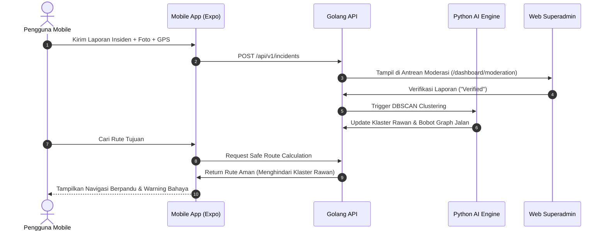

# 📱 JalanAman Mobile — Panduan & Fitur Pengguna (User)

Aplikasi mobile **JalanAman** dirancang khusus untuk peran **`User` (Warga, Pengendara Motor, dan Pejalan Kaki)** guna memberikan perlindungan preventif dan reaktif selama perjalanan malam hari di area perkotaan.

---

## 👤 Peran Pengguna: `User`
* **Target Pengguna:** Warga sipil, pengemudi ojek online, mahasiswa, pekerja lembur, dan masyarakat yang bermobilitas di waktu malam.
* **Platform:** React Native (Expo Router) untuk Android & iOS.
* **Tujuan Utama:** Menghindari zona rawan kejahatan, mendapatkan rute paling aman berpenerangan cukup, melaporkan bahaya lapangan, dan evakuasi darurat saat menghadapi ancaman.

---

## 🛡️ Daftar Fitur Komplit & Konkret

### 1. Komparasi Rute Cerdas (Safe Route vs Fast Route)
* **File Rute:** [`mobile/src/app/index.tsx`](file:///Users/muhfaiizr/Documents/Web%20Project/JalanAman/mobile/src/app/index.tsx)
* **Fungsi Konkret:**
  - **Dua Pilihan Rute Taktis:** Menampilkan perbandingan langsung antara **Rute JalanAman (Prioritas Keamanan)** dan **Rute Tercepat (Peta Standar)**.
  - **Indeks Keamanan Spasial:** Memberikan skor keselamatan (misal: *Safety Index 98%* vs *64%*) berdasarkan histori kriminalitas dan penerangan jalan.
  - **Visualisasi Penghindaran Bahaya:** Menandai koridor bahaya (area begal, gang gelap gulita) dan rute hijau yang memutar sedikit tetapi melewati pos polisi dan jalan protokol aktif.
  - **Radar Banner Lingkungan:** Indikator real-time yang memindai status radius 1.5 km di sekitar lokasi pengguna.

---

### 2. Navigasi Berpandu & Peringatan Bahaya Real-Time (Active Safe Navigation)
* **File Rute:** [`mobile/src/app/navigation.tsx`](file:///Users/muhfaiizr/Documents/Web%20Project/JalanAman/mobile/src/app/navigation.tsx)
* **Fungsi Konkret:**
  - **Turn-by-Turn Safe Guidance:** Petunjuk arah belokan demi belokan (jarak meter, nama jalan berikutnya) dengan mode visibilitas tinggi untuk malam hari.
  - **Peringatan Dini Bahaya (Spatial Hazard Alert):** Memunculkan peringatan otomatis saat pengguna mendekati radius 250m dari zona rawan:
    - *Contoh: "⚠️ Waspada: 250m di depan terdeteksi area rawan pembegalan & lampu padam."*
  - **Dynamic Re-Routing Otomatis:** Menghitung ulang jalur secara otomatis jika di rute depan baru saja diverifikasi adanya insiden darurat oleh Superadmin.
  - **HUD Ringkasan Perjalanan:** Estimasi waktu tiba (ETA), sisa jarak kilometer, dan indikator koneksi satelit GPS.

---

### 3. Pelaporan Insiden Warga (Crowdsourced Incident Reporting)
* **File Rute:** [`mobile/src/app/report.tsx`](file:///Users/muhfaiizr/Documents/Web%20Project/JalanAman/mobile/src/app/report.tsx)
* **Fungsi Konkret:**
  - **4 Kategori Insiden Utama:**
    1. 🔴 **Begal / Tindak Kekerasan:** Kejahatan fisik, ancaman senjata tajam, pemerasan.
    2. 🟡 **Lampu PJU Padam:** Jalan gelap minim penerangan umum.
    3. ⚪ **Jalan Rusak / Lubang Parah:** Ancaman kecelakaan lalu lintas.
    4. 🔵 **Area Sepi & Rawan:** Kerumunan geng motor, pemalakan liar.
  - **Geolokasi GPS Otomatis:** Mengambil koordinat lintang & bujur pengguna secara presisi tanpa input manual.
  - **Unggah Bukti Foto:** Fitur jepret kamera/galeri untuk menyertakan bukti visual kejadian.
  - **Deskripsi Lapangan:** Form keterangan detail untuk membantu petugas memverifikasi laporan.
  - **Terintegrasi Sistem Trust Score:** Laporan diberi bobot awal berdasarkan rekam jejak pengguna untuk mencegah laporan palsu/prank.

---

### 4. Direktori Titik Lindung 24 Jam (Safe Haven Directory)
* **File Rute:** [`mobile/src/app/shelters.tsx`](file:///Users/muhfaiizr/Documents/Web%20Project/JalanAman/mobile/src/app/shelters.tsx)
* **Fungsi Konkret:**
  - **Kategori Tempat Perlindungan Terverifikasi:**
    - 👮 **Kantor Polisi / Polsek / Pos Sabhara:** Tempat berlindung dengan personel bersenjata.
    - ⛽ **SPBU 24 Jam:** Lokasi ramai berpenerangan benderang dan memiliki CCTV aktif.
    - 🛡️ **Pos Keamanan Warga / Pos Ronda / Pos Satpam:** Bantuan komunitas warga lokal.
    - 🏪 **Minimarket 24 Jam:** Titik persinggahan darurat terdekat.
  - **Indikator Jarak & ETA Evakuasi:** Menghitung jarak jalan kaki/motor (misal: *320m • 1 menit*).
  - **Tombol Satu-Klik "Arahkan Rute":** Seketika mengalihkan navigasi aktif ke shelter tersebut saat pengguna merasa dibuntuti.

---

### 5. Tombol Panik & Evakuasi Darurat (Emergency SOS & Panic Mode)
* **File Rute:** [`mobile/src/app/sos.tsx`](file:///Users/muhfaiizr/Documents/Web%20Project/JalanAman/mobile/src/app/sos.tsx)
* **Fungsi Konkret:**
  - **Sirine Panik Beranimasi:** Tombol SOS merah besar dengan animasi denyut sinyal darurat (*pulse visual beacon*).
  - **Panggilan Darurat Instan (Fast Dispatch):**
    - 📞 **Polisi 110:** Panggilan langsung ke Command Center Polri.
    - 🚑 **Ambulans 118/119:** Panggilan penanganan medis darurat.
    - 👥 **Kontak Darurat Terdaftar:** Panggilan instan ke keluarga/kerabat.
  - **Broadcast Live Tracking:** Mengirim koordinat GPS langsung ke nomor darurat via SMS / WhatsApp secara instan.
  - **Mode Rute Evakuasi Cepat:** Tombol darurat yang langsung menuntun rute pelarian ke Pos Polisi terdekat.

---

## 🔄 Alur Sinkronisasi Data: Mobile User ↔ Backend & Superadmin



---

## 🚀 Cara Menjalankan Aplikasi Mobile

### 1. Masuk ke Direktori Mobile
```bash
cd mobile
```

### 2. Instalasi Dependensi
```bash
npm install
```

### 3. Menjalankan Server Pengembangan Expo
```bash
npx expo start
```

### 4. Menjalankan di Perangkat:
* **Android Device / Emulator:** Tekan huruf **`a`** di terminal.
* **iOS Simulator (macOS):** Tekan huruf **`i`** di terminal.
* **Perangkat Asli (Fisik):** Buka aplikasi **Expo Go** di ponsel Anda, lalu pindai QR Code yang tampil di terminal.
* **Web Browser (Pratinjau Cepat):** Tekan huruf **`w`** di terminal.
